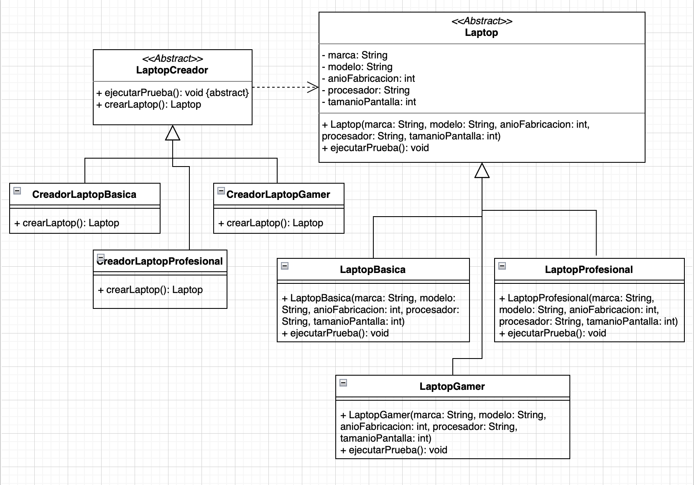

# Laboratorio Patrones de Diseño de Software - Semana 12

Implementación del patrón de diseño Factory Method para la creación de tres tipos de laptops: básica, gamer y profesional.

## Descripcion: 

Se desea crear tres modelos de laptops - uno basico, uno gamer y uno profesional - con atributos de marca/modelo, año de fabricacion, procesador y tamaño de pantalla. Cada laptop sobreescribe el método `ejecutarPrueba()` indicando su tipo. Se aplica el patrón `Factory Method`para delegar la creación a subclases creadoras concretas.

## Diagrama UML



## Estructura del proyecto

```text
LABORATORIO_S11-PDS/
│
├── src/
│   ├-- imagen_Diagrama/
│   │       ├
│   ├── Cafe.java                    // Componente base
│   ├── TostadoNegro.java            // Componente concreto
│   ├── Batido.java                  // Componente concreto
│   ├── Descafeinado.java            // Componente concreto
│   ├── Expreso.java                 // Componente concreto
│   ├── DecoradorComplemento.java    // Decorador abstracto
│   ├── Leche.java                   // Decorador concreto
│   ├── Moca.java                    // Decorador concreto
│   ├── Soya.java                    // Decorador concreto
│   ├── Crema.java                   // Decorador concreto
│   └── Main.java                    // Clase principal
└── README.md
```

## Clases del patrón

|                Clase.                |  Rol en el patrón  |                            Responsabilidad                                  |
|--------------------------------------|--------------------|-----------------------------------------------------------------------------|
| `Laptop`                             | Producto abstracto | Interfaz común a todos los tipos de laptop                                  |
| `LaptopGamer / Basica / Profesional` | Producto concreto  | Implementan `ejecutarPrueba()` según su tipo                                |
| `LaptopCreator`                      | Creador abstracto  | Declara el factory method `crearLaptop()` y la operación `ejecutarPrueba()` |
| `CreadorLaptop*`                     | Creador concreto   | Sobrescribe `crearLaptop()` para instanciar su laptop específica            |
| `DemoLaptopFactory`                  | Cliente (main)     | Usa los creadores para obtener y probar cada laptop                         |

## Cómo ejecutar

```bash
# Compilar
javac src/*.java

# Ejecutar
java -cp src DemoLaptopFactory
```

## Salida esperada

```text
BIENVENIDOS A LA FABRICA DE LAPTOPS
Corriendo programas en una Laptop para Gamer

Laptop para Gamer

Marca y Modelo: Macbook air

Año de Fabricacion: 2017

Procesador: Silicon M1

Tamaño de la Pantalla: 13
Corriendo programas en una Laptop Basica

Laptop Basica

Marca y Modelo: Dell Latitude

Año de Fabricacion: 2020

Procesador: intel core i7

Tamaño de la Pantalla: 14
Corriendo programas en una Laptop Profesional

Laptop para Profesional

Marca y Modelo: Macbook Pro

Año de Fabricacion: 2022

Procesador: Apple Silicon M2

Tamaño de la Pantalla: 16
```